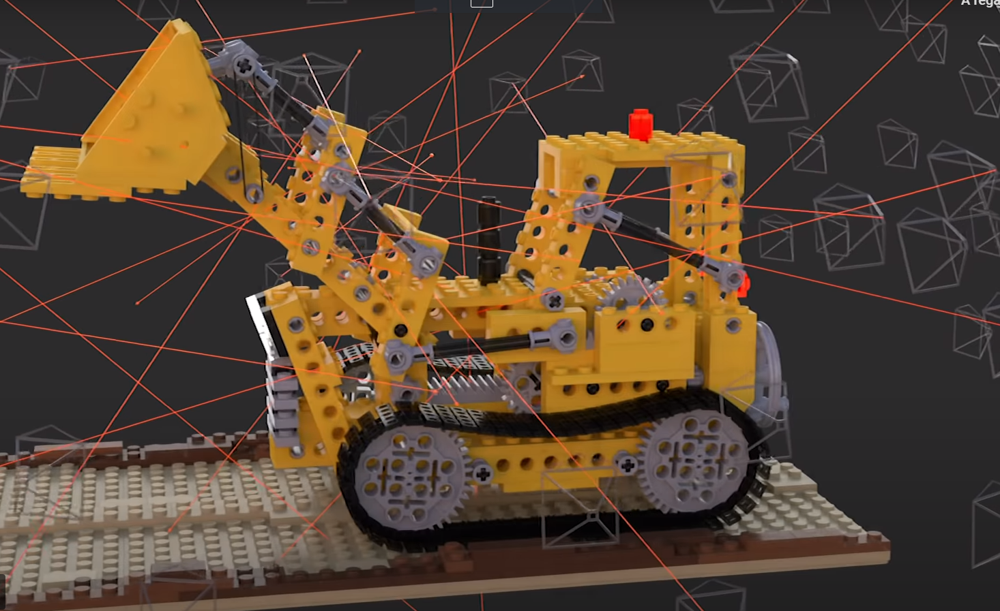
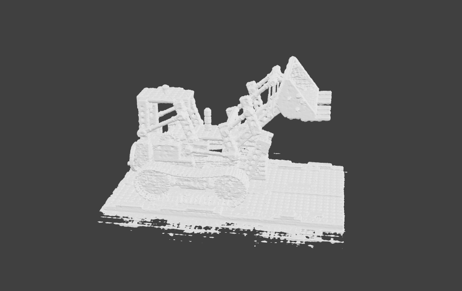

# présentation NeRF

 NeRF c'est pour Neural Radiance Fields
 
## ça vient d'où

 Fait par Matthew Tancik, Ben Mildenhall, Pratul P. Srinivasan, Jonathan T. Barron, Ravi Ramamoorthi, et Ren Ng
 
en 2020

## Description

 En simple, tu prends plusieurs photos et tu peux avoir un modèle ou une scène grâce aux photos et les voir en 3D

 

 

## Utilité

1 modélisation en temps réel 

2 moin lourd ,car c'est juste un logiciel et quelque image et non une scene 4k en 360 

## media
 
Vidéo https://www.youtube.com/watch?v=JuH79E8rdKc

site NeRF https://www.matthewtancik.com/nerf

