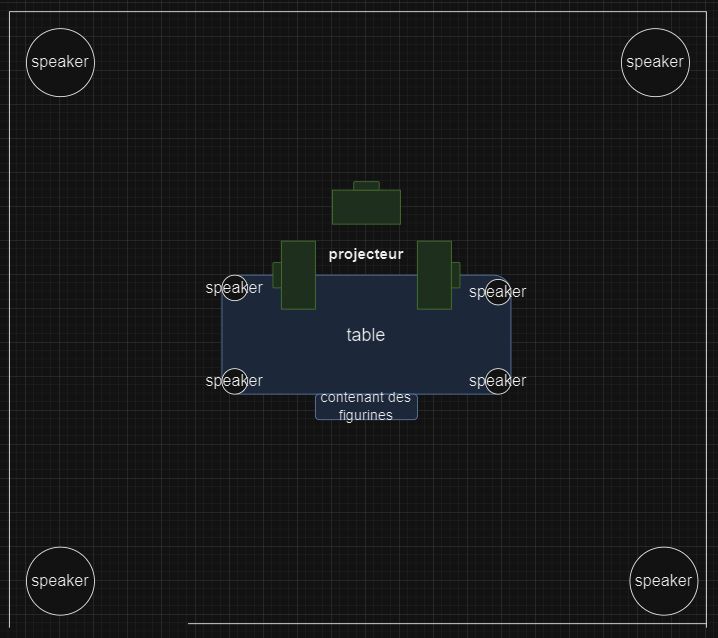
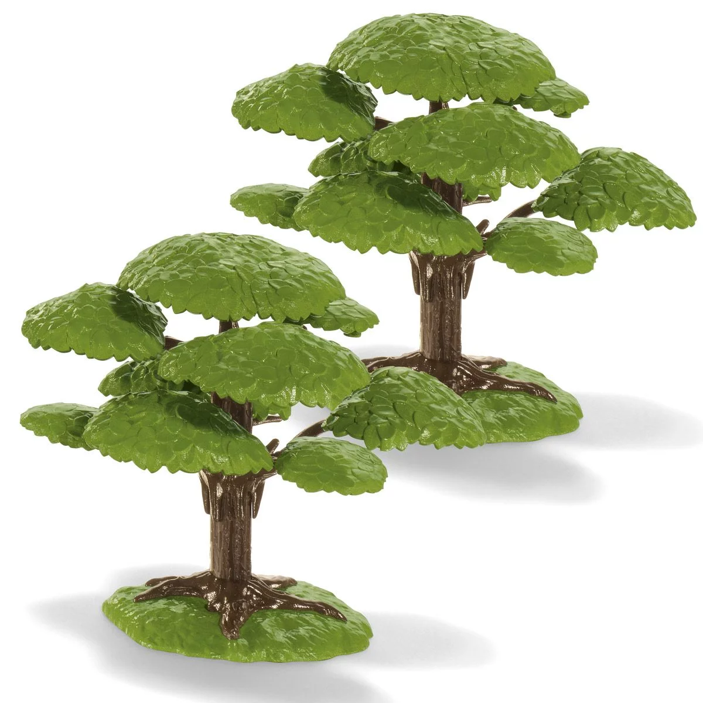
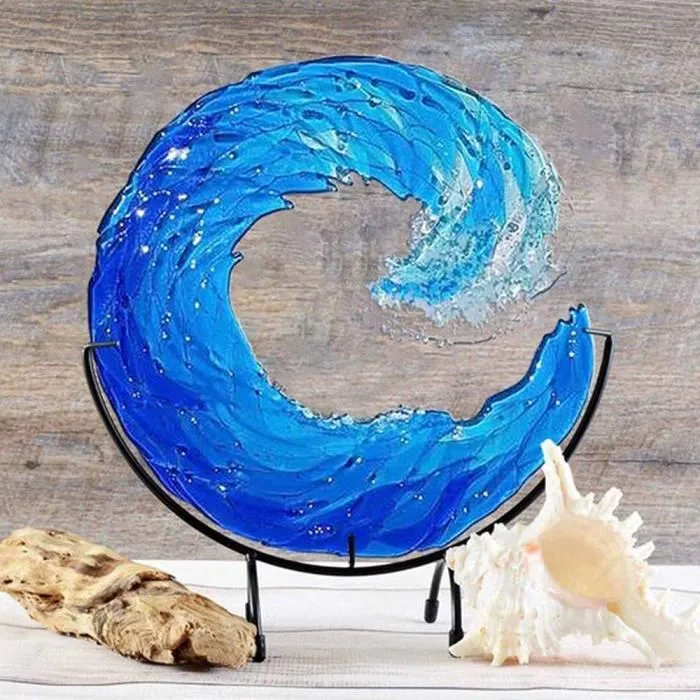
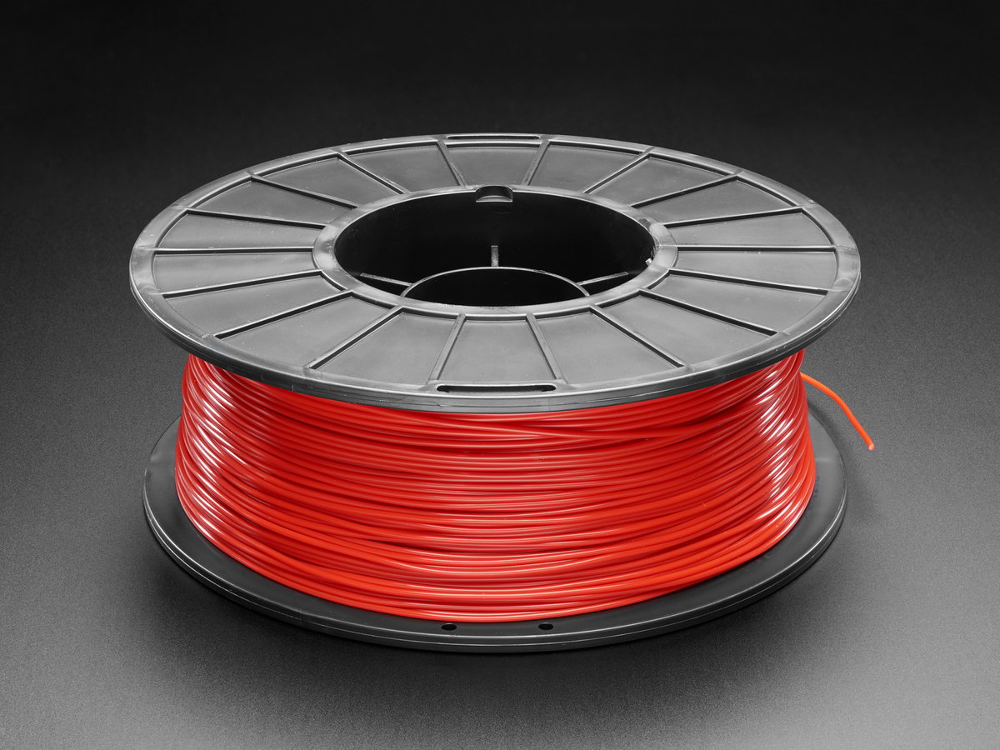
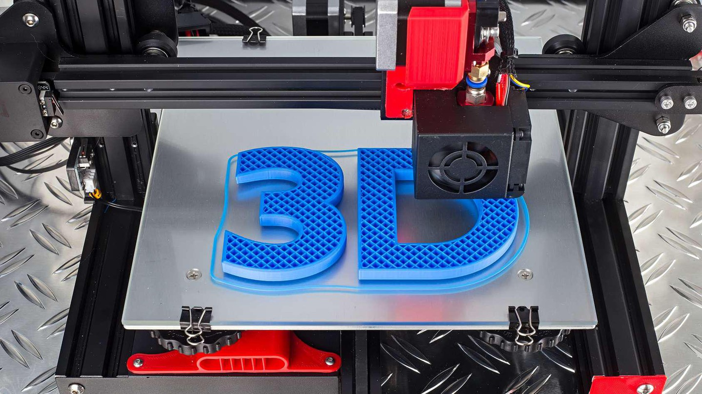
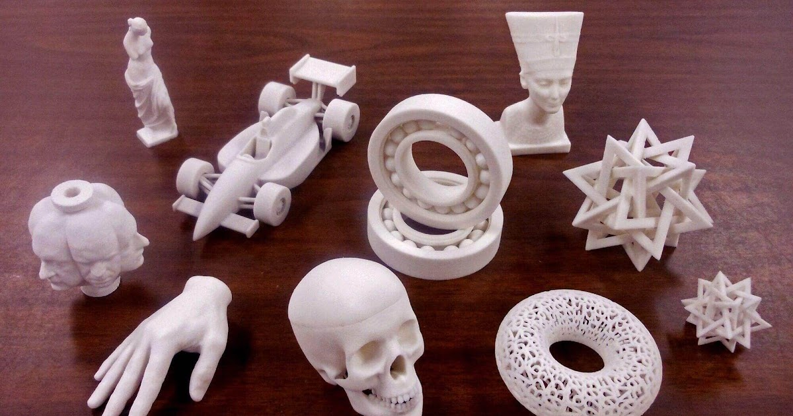
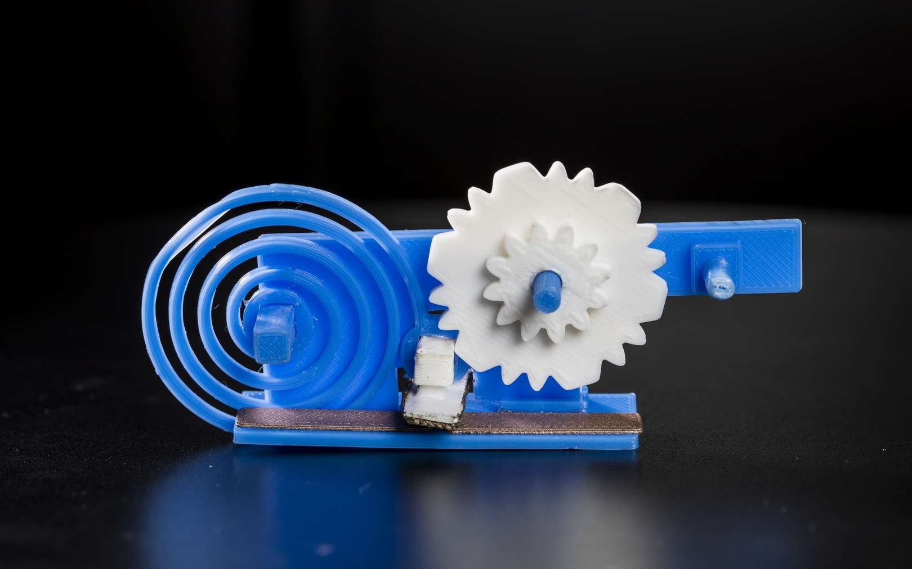

# Concept général 
un univers 3D projeté sur 3 murs gràce à des projecteurs. Cet univers changera dépendamment de l'objet de détection. cette objet sera détecté grâce à une détection d'image depuis l'interieur de la table.
Je vais créer les objet détectés qui seront des figurines avec des socles et des formes facile à détecter en dessous des socles.

# Inspirations 

## Conceptuelles
principalement un brain storm, le concept se raproche du projet AR que nous avons fait avec lora de la detection d'images.
les firuines auront des socles et des formes facile à détecter en dessous des socles.

## Artistique 
des figurines avec socle comme des figurine pop ou d'anime. Par contre, les figurines seront des élément de nature ou autre environement pour changer la scene 3D.

voici quelques examples â quoi les figurines pourraient ressembler

## Technique

l'impression utilise du filament fait de plusieur sorte de plastique et apres rechaufement peux construire en 3d des objets modélisé

 

 

## Concept spécifique

## cotés positifs

1 pas cher le filament ( environ 20$ pour 100 petites impressions )

2 une liberte de creations,possibilité de créer des objet adapté à notre projet

## media
 
Vidéo https://www.youtube.com/watch?v=lNjNls97wt0&t=56s

